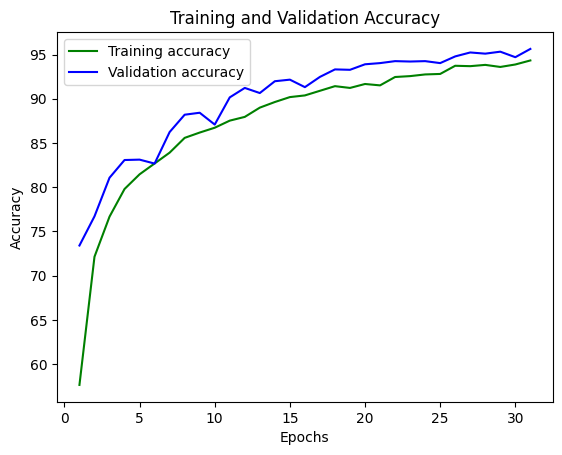
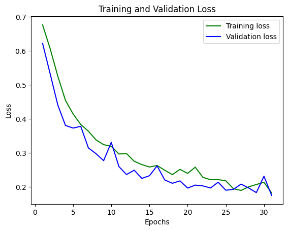

# Deepfake Detection Model

## Overview
This project implements a deep learning-based system for detecting deepfake videos. It uses a combination of EfficientNet-B3 and Transformer architecture to analyze facial features across video frames and classify videos as real or fake. The model achieves a 95% F1-score on the Celebrity Deepfake(V2) dataset. We use Streamlit to provide a user-friendly web interface for real-time video analysis and prediction.

## Features
- **Video Processing**: Extracts and processes frames from videos for face detection
- **Face Detection**: Uses MediaPipe for accurate face detection and cropping
- **Data Augmentation**: Multiple augmentation techniques for a balanced dataset
- **Deep Learning Model**: Combines EfficientNet-B3 with Transformer for temporal analysis
- **Training Pipeline**: Complete training workflow with mixed precision training
- **Inference System**: Streamlit-based web interface for real-time video analysis
- **Performance Metrics**: Comprehensive evaluation metrics and visualizations

## Model Architecture
### EfficientNet-B3 + Transformer

- **Feature Extractor**:  
  Built on the EfficientNet-B3 backbone, this component efficiently extracts rich spatial features from each individual frame. It leverages a compound scaling method to balance network depth, width, and input resolution while being pre-trained on ImageNet to provide robust initial feature recognition.

- **Temporal Processing**:  
  A Transformer encoder processes sequences of frame features, making use of positional encoding to keep track of the order of frames. The self-attention mechanism helps the model learn relationships between frames, capturing subtle temporal nuances that are essential for detecting deepfakes.

- **Classification Head**:  
  This multi-layer classifier is designed to consolidate spatial and temporal features into a final decision. It typically includes a reduction layer (e.g., linear transformation), followed by a GELU activation to smoothly handle non-linearity, and dropout layers to prevent overfitting. Additional techniques like layer normalization further stabilize training.

- **Input Processing**:  
  Designed to handle variable-length video sequences, this stage uses adaptive pooling to standardize the feature dimensions irrespective of sequence length. Pre-processing steps include resizing frames (e.g., to 112x112 pixels) and normalizing pixel intensities, while dynamic batching with padding ensures the model maintains temporal coherence across different video lengths.

### Key Components

- **Positional encoding for temporal information**:  
  Integrates the temporal position of each frame into the model, ensuring the order and context are preserved. This aids the Transformer encoder in distinguishing the progression of frames, which is essential for capturing video dynamics.

- **Multi-head self-attention mechanism**:  
  Allows the model to attend to various parts of the sequence simultaneously. This mechanism helps capture multiple dependencies among frames, enabling a more robust understanding of both local and global temporal relationships.

- **Gradient clipping and layer normalization**:  
  Gradient clipping limits the magnitude of gradients during backpropagation, preventing training issues like exploding gradients. Layer normalization standardizes the outputs of layers, leading to faster convergence and improved training stability across deep network layers.

- **Mixed precision training support**:  
  Combines 16-bit and 32-bit floating-point operations to reduce memory usage and speed up training. This technique leverages GPUs more efficiently while maintaining the necessary numerical stability for model convergence.


## Frameworks and Tools
- **PyTorch**: Deep learning framework
- **MediaPipe**: Face detection and tracking
- **Streamlit**: Web interface for model deployment
- **OpenCV**: Video processing and augmentation
- **Timm**: Pre-trained model library


## Data Preparation
### Face Detection and Cropping
- Extract faces from videos using MediaPipe
- Resize faces to 112x112 pixels
- Create consistent-length sequences

### Dataset Organization
- Split videos into train/test sets
- Create CSV files with labels
- Balance dataset between real/fake classes

### Data Augmentation
Implemented augmentation techniques:
- Horizontal flipping
- Random rotation (-15° to 15°)
- Brightness adjustment
- Contrast variation
- Gaussian noise addition
- Gaussian blur

## Model Training
### Setup
- Initialize EfficientNet-B3 with pre-trained weights
- Configure Transformer encoder
- Set up mixed precision training

### Training Process
- Batch size: 8
- Sequence length: 10-30 frames
- Learning rate: 1e-6
- Adam optimizer with weight decay
- Early stopping based on F1-score

### Monitoring
- Loss and accuracy tracking
- Confusion matrix generation
- F1-score, precision, recall metrics

## Prediction Interface
The system includes a Streamlit web interface that:
- Accepts video file uploads
- Can try it with custom trained model using our training method
- Processes videos in real-time
- Displays confidence scores
- Shows classification results

## Usage
1. Install requirements:
    ```sh
    pip install -r requirements.txt
    ```
2. Run the Streamlit interface:
    ```sh
    streamlit run DeepfakeDetection.py
    ```
3. Upload a video and get predictions

## Model Performance
- Accuracy: ~95%
- F1-Score: ~95%
- Real-time processing capability
- Robust to various video qualities


## Limitations
- Requires clear facial visibility
- Sensitive to extreme lighting conditions
- Limited to processed deepfake detection
- Memory-intensive for long videos
